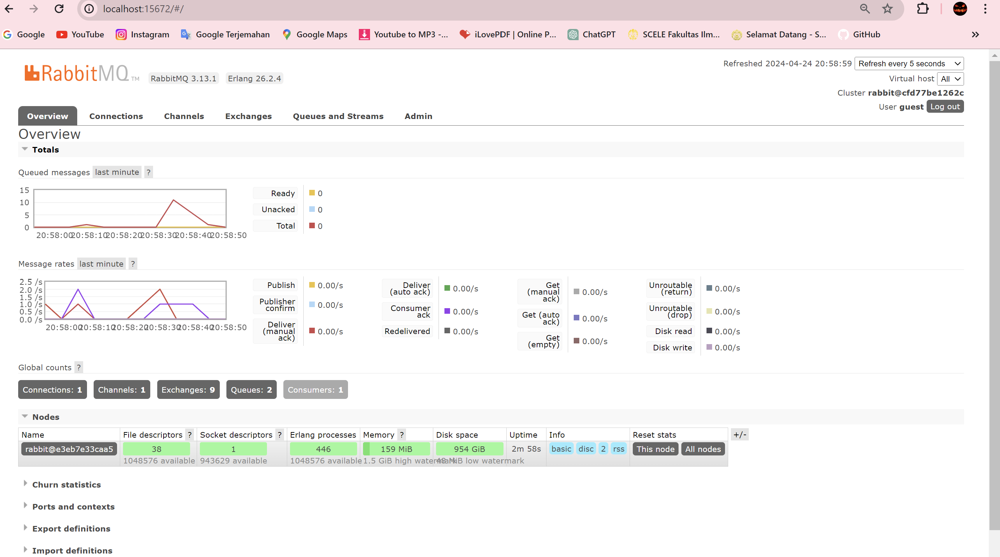
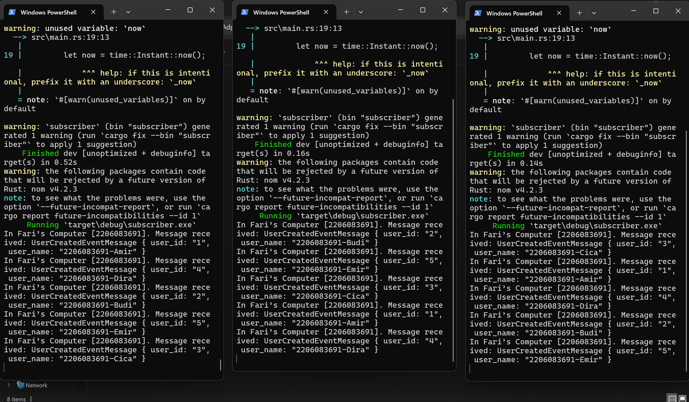
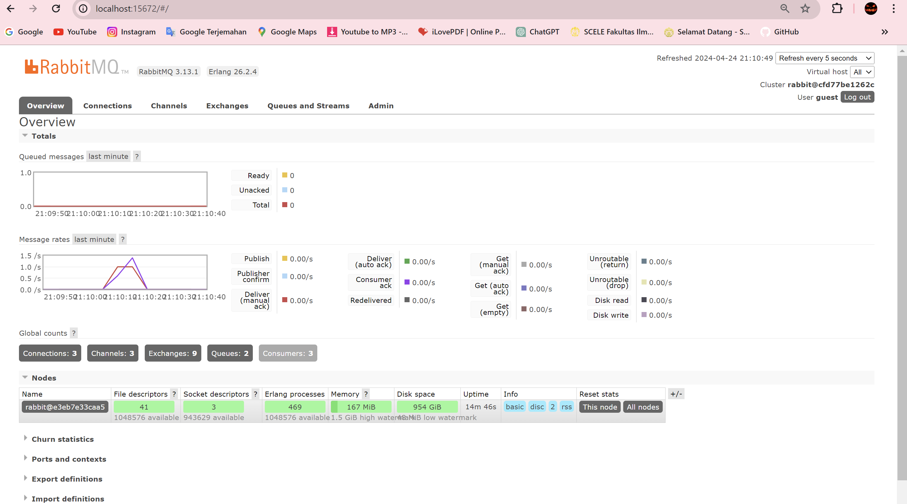

> Fari Hafizh Ramadhan - 2206083691

# Modul 8: Software Architecture pt 1

1. what is amqp?
    AMQP adalah singkatan dari Advanced Messaging Queuing Protocol. Ini adalah standar desain untuk pertukaran pesan yang canggih, yang membantu menentukan cara pesan dikirim dan diterima dalam aplikasi atau komunikasi data yang beragam saat ini.  

2.  what it means? guest:guest@localhost:5672 , what is the first quest, and what is
    the second guest, and what is localhost:5672 is for?
     Jadi, guest:guest@localhost:5672 itu adalah string yang mengikuti format URI standar untuk nyambung ke server AMQP. Di situ, yang pertama guest itu username-nya, sementara yang kedua guest itu password-nya. localhost:5672 itu adalah alamat dan nomor port dari server AMQP. "localhost" itu nyambung ke alamat lokal server yang berjalan di mesin yang sama, dan 5672 itu nomor port default yang dipake server AMQP.  

3. Simulation slow subscriber

   Berbeda dengan ketika dieksekusi tanpa sleep, terlihat bahwa terdapat spike yang menyentuh angka 11 pada grafik queued message di atas. Hal ini terjadi karena ketika saya menjalankan 3 perintah `cargo run` dengan cepat pada publisher sehingga terdapat 11 pesan yang dikirim perlu dimasukkan ke queue terlebih dahulu.   

4. Reflection and Running at least three subscribers
   
   
Pada gambar pertama, terlihat bahwa terdapat 3 subscriber yang dijalankan. Dan ketika saya melakukan hal yang sama seperti pada poin nomor 3, yaitu menjalankan 2 perintah cargo run dengan cepat, semua pesan yang dikirim dibagi eksekusinya ke 3 subscriber tersebut. Hal ini mengakibatkan grafik yang dihasilkan seperti pada gambar 2. Meskipun dieksekusi dengan sleep, dapat dilihat dari grafik queued messages, sekarang tidak ada message yang masuk ke queue. Hal ini terjadi karena message telah dieksekusi oleh 3 subscriber berbeda sehingga message tidak perlu lagi mengantri di queue untuk dieksekusi.